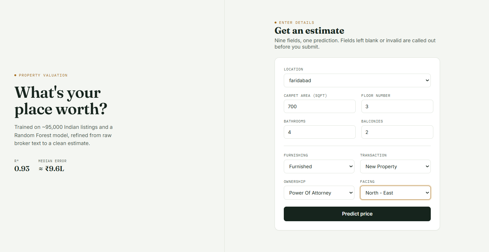
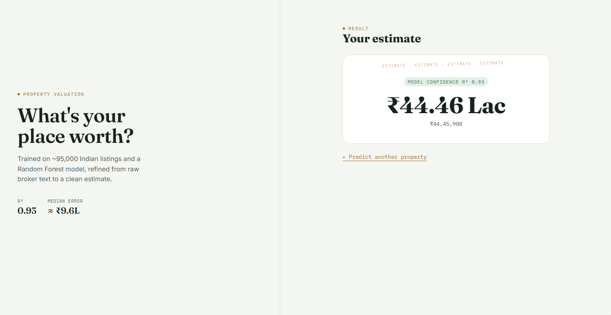

# House Price Prediction — End-to-End ML Web App

Predicts Indian residential property prices from a Kaggle listings dataset. A scikit-learn
Random Forest model (wrapped in a full preprocessing `Pipeline`) is trained in a notebook,
served through a FastAPI backend, and consumed by a React + TypeScript frontend.

## Overview

1. **`notebooks/house_price_model.ipynb`** — cleans the raw Kaggle CSV, engineers features,
   trains and compares two regression models, and exports the winning model as
   `house_price.pkl` plus the list of known locations as `locations.json`.
2. **`backend/`** — a FastAPI service that loads `house_price.pkl` once at startup and exposes
   a `/predict` endpoint.
3. **`frontend/`** — a React form where a user enters property details and sees the predicted
   price.

## Architecture

```
┌──────────────┐      POST /predict       ┌───────────────┐      model.predict()      ┌──────────────────┐
│   Frontend   │ ───────────────────────▶ │    Backend     │ ────────────────────────▶ │  house_price.pkl │
│ React + Vite │ ◀─────────────────────── │    FastAPI     │ ◀──────────────────────── │ (sklearn Pipeline)│
│ (port 5173)  │   { predicted_price }    │  (port 8000)   │      predicted price       └──────────────────┘
└──────────────┘                          └───────────────┘
```

## Tech stack

| Layer      | Stack |
|------------|-------|
| Modeling   | pandas, scikit-learn (Pipeline + ColumnTransformer), joblib |
| Backend    | FastAPI, Pydantic v2, Uvicorn |
| Frontend   | React 18, TypeScript, Vite, react-router-dom |

## Project structure

```
house-price-app/
├── notebooks/
│   ├── house_price_model.ipynb
│   └── data/                      # raw CSV goes here (gitignored)
├── backend/
│   ├── app/
│   │   ├── main.py                # FastAPI app, CORS, model loaded at startup (lifespan)
│   │   ├── api/routes/prediction.py   # GET /health, GET /locations, POST /predict
│   │   ├── core/config.py         # settings from .env
│   │   ├── schemas/prediction.py  # PredictionRequest / PredictionResponse
│   │   ├── services/
│   │   │   ├── preprocessing.py   # request -> one-row DataFrame
│   │   │   └── inference.py       # load .pkl, run predict
│   │   └── utils/logging_config.py
│   ├── models/
│   │   ├── house_price.pkl        # copied from the notebook
│   │   └── locations.json         # copied from the notebook
│   ├── tests/test_prediction.py
│   ├── requirements.txt
│   ├── .env.example
│   └── Dockerfile
└── frontend/
    ├── src/
    │   ├── api/predictionClient.ts
    │   ├── components/PredictionForm.tsx
    │   ├── pages/{HomePage,ResultPage,NotFoundPage}.tsx
    │   ├── types/prediction.ts
    │   └── App.tsx
    ├── public/locations.json      # copied from the notebook
    └── .env.example
```

## Dataset

**House Price** by Juhi Bhojani — <https://www.kaggle.com/datasets/juhibhojani/house-price>
(~187,000 Indian property listings).

Download it with the Kaggle CLI:

```bash
pip install kaggle
# Get your API token: Kaggle -> Settings -> API -> "Create New Token"
# Place kaggle.json in ~/.kaggle/ (macOS/Linux) or C:\Users\<you>\.kaggle\ (Windows)
kaggle datasets download -d juhibhojani/house-price -p notebooks/data --unzip
```

The raw CSV is **not** committed to this repo (see `.gitignore`) — download it yourself before
running the notebook.

## Model metrics (test set)

| Model             | MAE          | RMSE         | R²     |
|-------------------|-------------:|-------------:|-------:|
| Linear Regression | ₹4,156,373.64 | ₹6,662,528.05 | 0.7492 |
| **Random Forest (chosen)** | **₹959,527.03** | **₹3,433,784.05** | **0.9334** |

The Random Forest model was chosen and exported as `house_price.pkl` — it roughly halves the
error and explains ~93% of price variance on held-out data, versus ~75% for the linear baseline.

## Backend setup

```bash
cd backend
python -m venv .venv
source .venv/bin/activate      # Windows: .venv\Scripts\activate
pip install -r requirements.txt
```
⚠️ `house_price.pkl` is not committed to this repo.
Run `notebooks/house_price_model.ipynb` top to bottom first — the last cell
exports `house_price.pkl` and `locations.json` — then copy them :

# Copy the artifacts produced by the notebook:
```bash
cp ../notebooks/house_price.pkl models/house_price.pkl
cp ../notebooks/locations.json models/locations.json

cp .env.example .env
uvicorn app.main:app --reload
# open http://localhost:8000/docs and try /predict from the Swagger UI
```

Run the tests:

```bash
pytest
```

### Backend environment variables

| Variable          | Default                     | Description                              |
|--------------------|------------------------------|-------------------------------------------|
| `MODEL_PATH`       | `models/house_price.pkl`     | Path to the pickled sklearn Pipeline      |
| `LOCATIONS_PATH`   | `models/locations.json`      | Path to the known-locations list          |
| `CORS_ORIGINS`     | `["http://localhost:5173"]`  | Allowed frontend origins                  |
| `APP_NAME`         | `House Price Prediction API` | Displayed in `/docs`                      |

> ⚠️ **Version pinning:** a pickle only loads reliably with the matching scikit-learn version.
> Check your notebook's version with `sklearn.__version__` and update `scikit-learn` in
> `requirements.txt` to match before deploying.

## Frontend setup

```bash
cd frontend
npm install
cp .env.example .env

# Copy the location list produced by the notebook:
cp ../notebooks/locations.json public/locations.json

npm run dev
# open http://localhost:5173
```

### Frontend environment variables

| Variable              | Default                 | Description                  |
|------------------------|--------------------------|-------------------------------|
| `VITE_API_BASE_URL`    | `http://localhost:8000`  | Base URL of the FastAPI backend |

## API reference

### `GET /health`

```json
{ "status": "ok" }
```

### `GET /locations`

Returns the list of locations seen during training (anything else is mapped to `"Other"`).

### `POST /predict`

Request body:

```json
{
  "location": "new-delhi",
  "carpet_area_sqft": 1200,
  "floor_num": 3,
  "bathroom": 2,
  "balcony": 2,
  "furnishing": "Semi-Furnished",
  "transaction": "Resale",
  "ownership": "Freehold",
  "facing": "East"
}
```

Response:

```json
{ "predicted_price": 4564250.0 }
```

curl example:

```bash
curl -X POST http://localhost:8000/predict \
  -H "Content-Type: application/json" \
  -d '{
    "location": "new-delhi",
    "carpet_area_sqft": 1200,
    "floor_num": 3,
    "bathroom": 2,
    "balcony": 2,
    "furnishing": "Semi-Furnished",
    "transaction": "Resale",
    "ownership": "Freehold",
    "facing": "East"
  }'
```

## Screenshots

### Form



### Result



## Running the full stack

1. Terminal 1: `cd backend && uvicorn app.main:app --reload` (port 8000)
2. Terminal 2: `cd frontend && npm run dev` (port 5173)
3. Open `http://localhost:5173`, fill in the form, submit, and see the predicted price.


